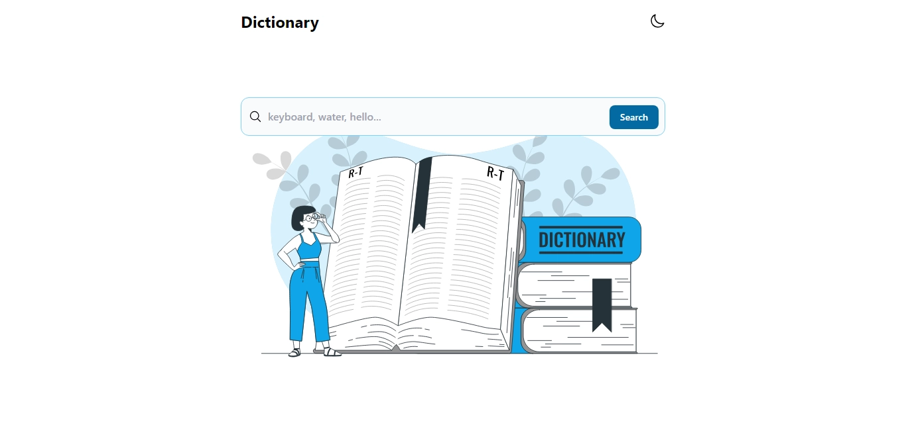
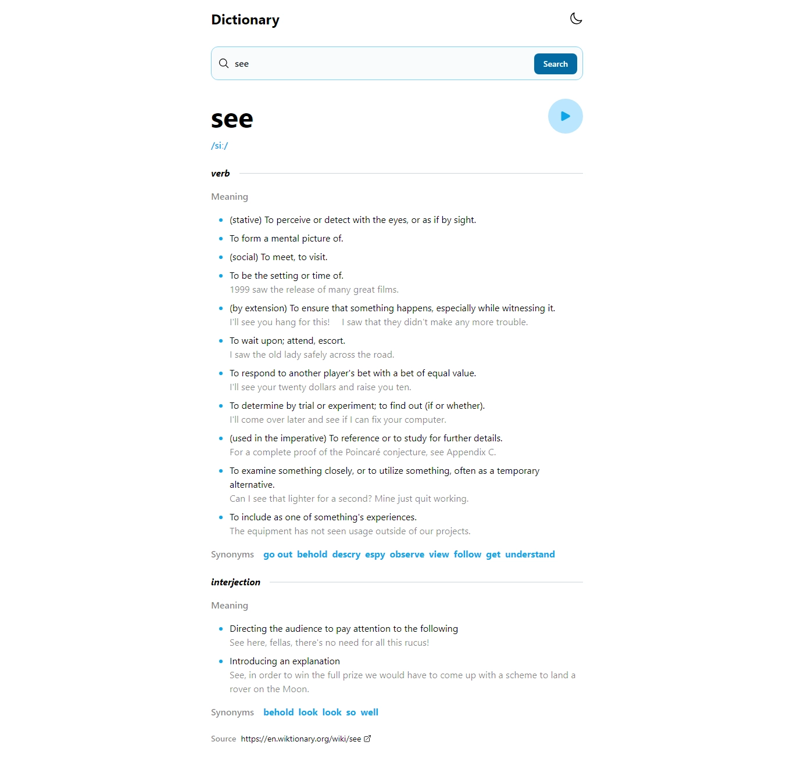

# Dictionary

---

## Descripción

Aplicación web para buscar palabras en un diccionario en ingles, la cual muestra su significado con ejemplos, pronunciación (texto y audio), sinónimos, antónimos y la fuente de la información.

## Capturas

## Tecnologías

- React
- Tailwind
- React Router Dom (Utilizado para queryParams)

### Commandos

- Clona el repositorio
- `npm install`
- visita `http://localhost/5173`
